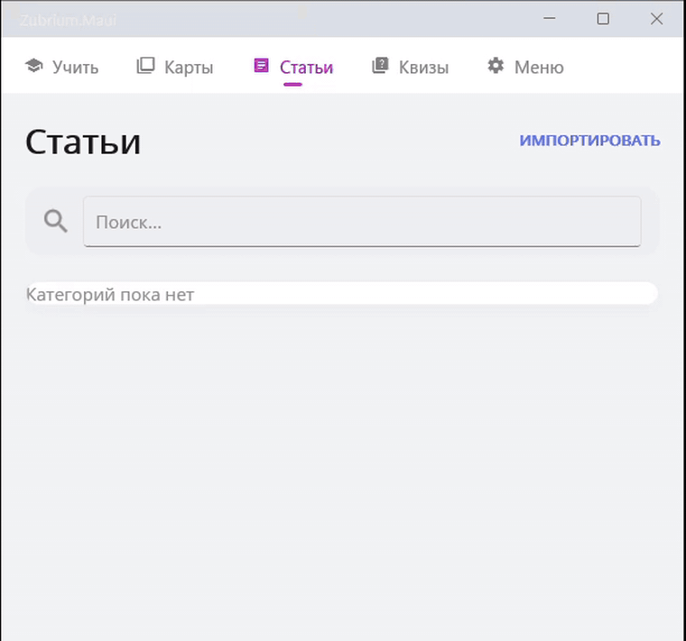
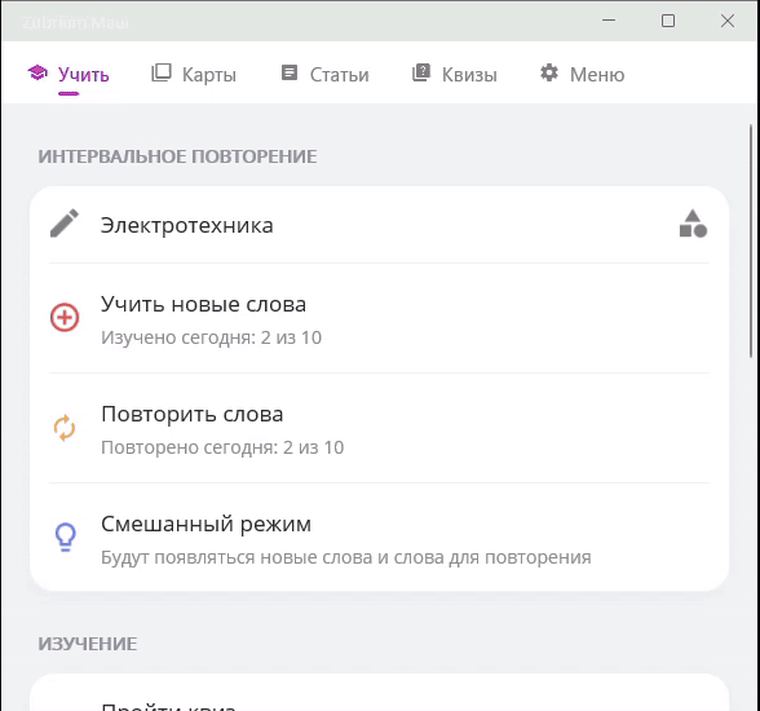
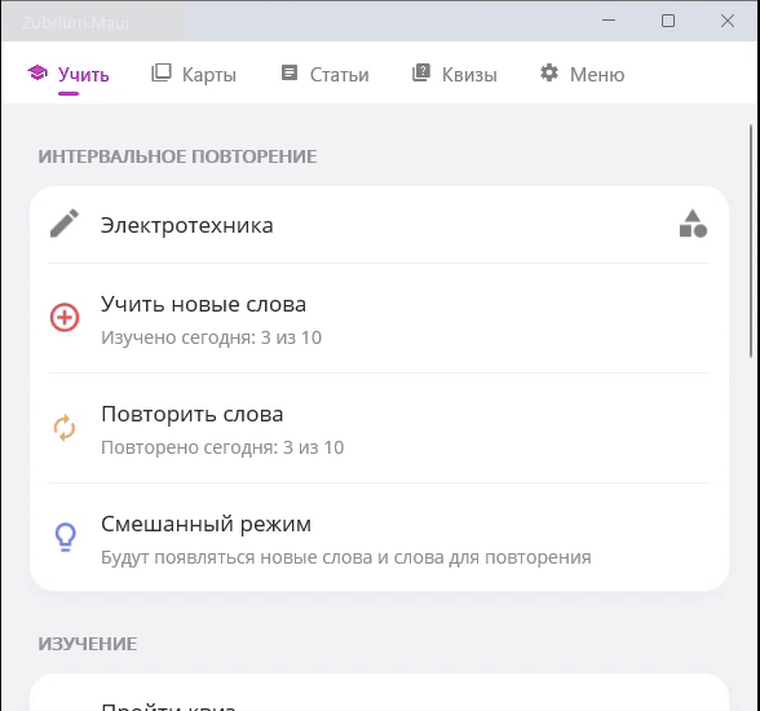

# Zubrium

Кроссплатформенное приложение для обучения по методу интервального повторения.
Весь учебный материал — карточки, тесты и конспекты — описывается одним Markdown-файлом,
который легко сгенерировать нейросетью и импортировать в приложение за пару секунд.

<p align="center">
  <!-- TODO: заменить на реальную GIF-демонстрацию основного сценария (импорт → сессия → квиз) -->
  
</p>

<p align="center">
  
  
  
  
</p>

---

## О проекте

Большинство приложений для интервального повторения заставляют вручную заполнять карточки
через формы. Zubrium исходит из другого сценария: материал по теме проще один раз получить
текстом (в том числе от языковой модели), чем собирать по полям.

Поэтому единственный формат контента в Zubrium — Markdown с небольшим набором расширений.
Один файл может содержать колоду карточек, набор тестовых вопросов и теоретические статьи
одновременно. Поддерживаются форматирование текста, таблицы и формулы LaTeX.

## Возможности

| Раздел | Описание |
| --- | --- |
| **Карточки** | Двусторонние карточки с интервальным повторением. Планировщик сам назначает дату следующего показа. |
| **Квизы** | Вопросы с выбором ответа и разбором каждого варианта. |
| **Статьи** | Теоретический материал (конспекты, правила, лекции) для чтения внутри приложения. |
| **Категории** | Группировка материала по предметам и темам; выбор категорий для конкретной сессии. |
| **Импорт** | Вставка текста, загрузка файла с устройства, генерация через нейросеть по готовому промпту. |
| **Режимы сессии** | «Только новые», «Повторение», «Смешанный» с дневным лимитом на новые и повторяемые карточки. |
| **Прогресс** | Учёт ежедневной активности и статуса освоения материала. |

<table>
  <tr>
    <td width="400">
      <!-- TODO: GIF импорта Markdown-файла и появления карточек в колоде -->
      
      <p align="center"><sub>Импорт материала из Markdown</sub></p>
    </td>
    <td width="400">
      <!-- TODO: GIF учебной сессии — переворот карточки, оценка, следующий интервал -->
      
      <p align="center"><sub>Учебная сессия с карточками</sub></p>
    </td>
  </tr>
  <tr>
    <td width="400">
      <!-- TODO: GIF прохождения квиза с показом разбора ответа -->
      
      <p align="center"><sub>Квиз с разбором ответов</sub></p>
    </td>
    <td width="400">
      <!-- TODO: GIF чтения статьи с LaTeX-формулами и таблицами -->
      
      <p align="center"><sub>Статья с формулами и таблицами</sub></p>
    </td>
  </tr>
</table>

## Как пользоваться

1. **Добавьте материал.** Вкладка импорта: вставьте текст, выберите файл или сгенерируйте
   контент нейросетью по встроенному промпту.
2. **Задайте план.** В настройках укажите, сколько новых и повторяемых карточек изучать в день.
3. **Запустите сессию.** Выберите категории и режим, изучайте карточки, оценивая, вспомнили вы
   ответ или нет.
4. **Закрепите знания.** Пройдите квиз по теме или перечитайте статью.

## Формат контента

Контент — это Markdown-файл с необязательным YAML-заголовком и блоками-контейнерами.

```markdown
---
category: Биология
---

::: card
# Митохондрия
Что такое митохондрия?

--- brief
Органелла, отвечающая за синтез АТФ.

--- detailed
Двумембранная органелла эукариот. Внутренняя мембрана образует кристы,
на которых происходит окислительное фосфорилирование. Имеет собственную ДНК.
:::

::: quiz {title="Клеточное дыхание"}
## Где синтезируется большая часть АТФ в клетке?
- [ ] В ядре
- [x] В митохондриях
- [ ] В аппарате Гольджи

--- explanation
АТФ синтезируется на внутренней мембране митохондрий в ходе окислительного фосфорилирования.
:::

::: article
# Гликолиз
Гликолиз — метаболический путь расщепления глюкозы до пирувата.
Формула суммарной реакции: $C_6H_{12}O_6 + 2NAD^+ \rightarrow 2C_3H_4O_3 + 2NADH$.
:::
```

| Элемент | Назначение |
| --- | --- |
| `category:` в YAML | Категория, к которой привязывается весь материал файла. |
| `::: card` | Карточка. Секции `--- brief` и `--- detailed` — краткий и развёрнутый ответ. |
| `::: quiz` | Набор вопросов; вопросы разделяются строкой `---`, правильный вариант помечается `- [x]`. |
| `::: article` | Статья для чтения. |
| `{title="..."}` | Явный заголовок блока; иначе берётся первый заголовок внутри блока. |

Внутри блоков доступны стандартный Markdown, таблицы и формулы LaTeX (`$...$`).

## Алгоритм повторения

В версии 0.1 используется фиксированная лестница интервалов: **1 → 2 → 4 → 9 → 25 дней**.
Успешный ответ переводит карточку на следующий интервал, ошибка — сбрасывает прогресс.
После прохождения всего цикла карточка помечается как освоенная.

Логика вынесена в отдельный модуль `Zubrium.SpacedRepetition` за интерфейсом
`ISpacedRepetitionService`, что позволяет заменить её на более сложную модель (SM-2, FSRS)
без изменения остального кода.

## Архитектура

Решение разбито на слои, ядро не зависит от UI и хранилища.

| Проект | Ответственность |
| --- | --- |
| `Zubrium.Domain` | Модели предметной области: карточка, колода, квиз, статья. |
| `Zubrium.Content` | Разбор Markdown в модели (`Markdig`), репозиторий контента. |
| `Zubrium.SpacedRepetition` | Планировщик интервального повторения. |
| `Zubrium.Persistence` | Сущности БД и мапперы, хранилище SQLite. |
| `Zubrium.Maui` | Приложение .NET MAUI: экраны, навигация, рендеринг Markdown и LaTeX. |
| `Zubrium.Tests` | Модульные тесты. |

**Технологии:** .NET 10, .NET MAUI, CommunityToolkit.Mvvm, SQLite (`sqlite-net-pcl`),
Markdig, CSharpMath (рендеринг LaTeX), SkiaSharp.

## Сборка и запуск

Требуется .NET 10 SDK и рабочая нагрузка MAUI:

```bash
dotnet workload install maui
```

Сборка и запуск:

```bash
git clone https://github.com/SergeySuhatsky/Zubrium.git
cd Zubrium

# Windows
dotnet build Zubrium.Maui/Zubrium.Maui.csproj -f net10.0-windows10.0.19041.0

# Android (нужен подключённый девайс или эмулятор)
dotnet build Zubrium.Maui/Zubrium.Maui.csproj -f net10.0-android -t:Run
```

Тесты:

```bash
dotnet test Zubrium.Tests/Zubrium.Tests.csproj
```

## Поддерживаемые платформы

Android, iOS, Windows, macOS (Mac Catalyst). Сборка под iOS и macOS доступна только на macOS.

## Лицензия

[MIT](LICENSE) © 2026 SergeySuhatsky
